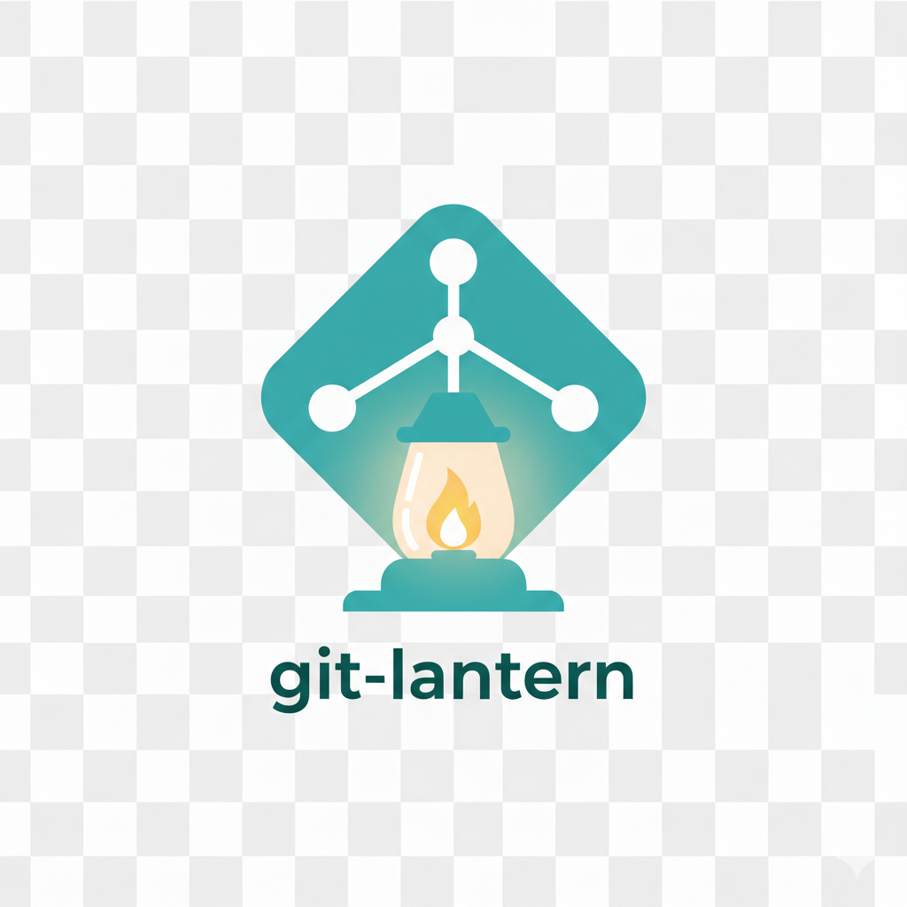

# git-lantern



Local and GitHub repository visibility toolkit. The CLI is `lantern`.

## Quick start

```bash
python3 -m venv venv
source venv/bin/activate
pip install -e .
lantern --help
```

## Common usage

Primary workflows:
- Local repo status and sync: `docs/use-cases.md#local-repo-status-and-sync`
- GitHub/GitLab/Bitbucket repos: `docs/use-cases.md#github--gitlab--bitbucket-repos-forge`
- Gists and snippets: `docs/use-cases.md#gists-and-snippets`
- Server config: `docs/use-cases.md#server-config-github-gitlab-bitbucket`

Commands (jump to detailed guides):
- `lantern repos` -> `docs/use-cases.md#lantern-repos`
- `lantern scan` -> `docs/use-cases.md#lantern-scan`
- `lantern status` -> `docs/use-cases.md#lantern-status`
- `lantern table` -> `docs/use-cases.md#lantern-table`
- `lantern find` -> `docs/use-cases.md#lantern-find`
- `lantern duplicates` -> `docs/use-cases.md#lantern-duplicates`
- `lantern sync` -> `docs/use-cases.md#lantern-sync`
- `lantern report` -> `docs/use-cases.md#lantern-report`
- `lantern forge list` -> `docs/use-cases.md#list-repos-from-a-server`
- `lantern forge clone` -> `docs/use-cases.md#clone-missing-repos-to-a-workspace`
- `lantern forge gists ...` -> `docs/use-cases.md#list-gists-github`
- `lantern forge snippets ...` -> `docs/use-cases.md#list-snippets-gitlabbitbucket`
- `lantern config export/import/path` -> `docs/use-cases.md#server-config-github-gitlab-bitbucket`

Quick examples:
```bash
lantern status --root ~/workspace --fetch
lantern sync --root ~/workspace --pull --only-clean --only-upstream
lantern forge list --server github.com --output data/github.json
lantern forge clone --server github.com --input data/github.json --root ~/workspace
lantern forge gists list --server github.com --output data/gists.json
```

## Environment

Create `.env` from `.env.example` if you want API access. For multi-server setups (GitHub/GitLab/Bitbucket), use `~/.config/git-lantern/config.json` or `~/.git-lantern/config.json`.

Export/import server config:
```bash
lantern config export --output git-lantern-servers.json
lantern config import --input git-lantern-servers.json
lantern config path
```

## Shell completion

Lantern ships bash completion via argcomplete.

```bash
pip install -e .
source completions/lantern.bash
```

## Development

Scripts:
```bash
./scripts/build.sh
./install
./scripts/test.sh
./scripts/lint.sh
./scripts/local_ci.sh
./scripts/install_git_hooks.sh
./scripts/bump_version.sh patch
./scripts/update_submodules.sh
./scripts/generate_man.sh
./scripts/packaging_init.sh
./scripts/release.sh
./scripts/release.sh --no-tag
./scripts/release.sh --tag-prefix v
```

Makefile shortcuts:

```bash
make build
make test
make lint
make ci
make bump
make submodules
make man
make packaging
make release
```

Local testing:

```bash
make lint
make test
make ci
```

The scripts automatically detect a suitable `python3` (3.8+) and use a local virtualenv at `./.venv`. You can optionally set `PYTHON_BIN` to point to a specific Python 3.8+ interpreter, or set `VENV_DIR` to change the virtualenv location before running the scripts. If virtualenv creation fails, install `python3-venv` (Debian/Ubuntu) or the equivalent package for your OS.

## Git hooks

Install the pre-commit hook to run local CI before commits:

```bash
./scripts/install_git_hooks.sh
```

Skip or speed up:

```bash
SKIP_LANTERN_PRECOMMIT=1 git commit -m "..."
LANTERN_PRECOMMIT_FAST=1 git commit -m "..."
```

## CI workflows

- `.github/workflows/ci.yml` uses ci-helpers Python CI.
- Packaging workflows (Homebrew, deb, rpm, PPA) are wired to ci-helpers presets.
- `.github/workflows/release.yml` builds dist tarballs and publishes a GitHub release.
- `release.yml` supports tags like `1.2.3` or `v1.2.3` and can publish Homebrew when enabled.
- `release.yml` auto-publishes Homebrew on tag pushes and attaches deb/rpm artifacts.
- `.github/workflows/auto-tag.yml` tags release merges from `release/X.Y.Z` or `release/X.Y.Z-rcN` branches.
- Release notes are generated via ci-helpers and updated on every publish; man pages are generated during release builds.
- Update the Homebrew `homepage` and tap/release inputs before publishing.
- PPA publishing requires `PPA_GPG_PRIVATE_KEY`, `PPA_GPG_PASSPHRASE`, and `PPA_LAUNCHPAD_SSH_KEY` secrets.

## Command reference

See `docs/commands.md` for the full command reference and `docs/use-cases.md` for detailed workflows.

## Notes

- `--fetch` will run `git fetch --prune` on each repo to refresh remote refs.
- Ahead/behind and main-branch distance use local remote-tracking refs.
